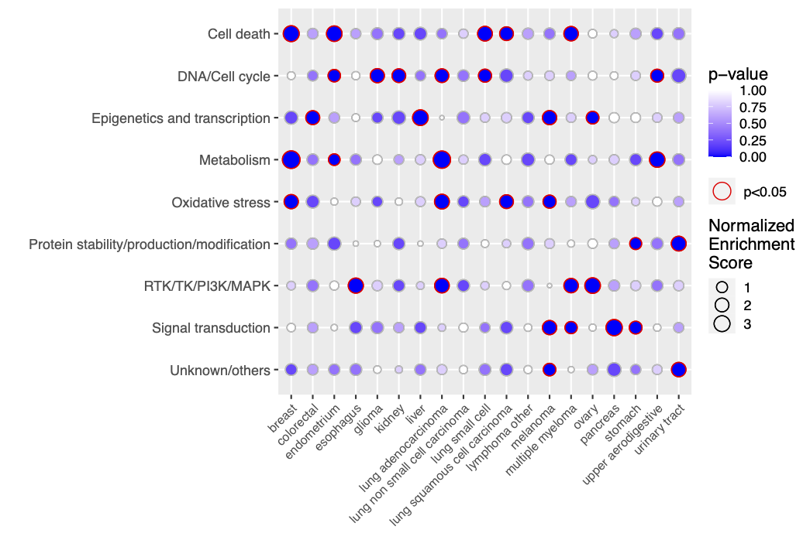
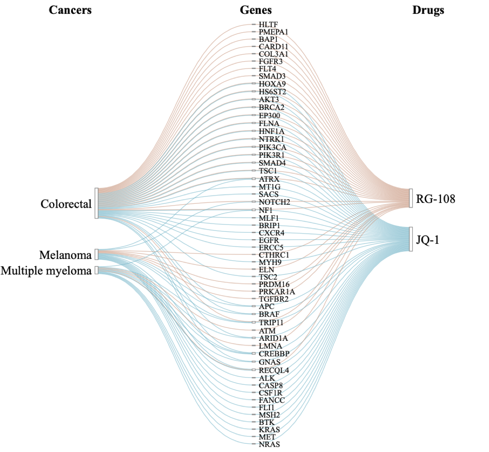

[](https://cran.r-project.org/package=EnrichIntersect)

# EnrichIntersect

This is a flexible R package for enrichment analysis based on user-defined sets. It allows users to perform over-representation analysis of the custom sets among any specified ranked feature list, hence making enrichment analysis applicable to various types of data from different scientific fields. EnrichIntersect also enables an interactive means to visualize identified associations based on, for example, the mix-lasso model ([Zhao et al., 2022](https://doi.org/10.1016/j.isci.2022.104767)) or similar methods. A user-manual description of features, function calls and examples can be found from the [vignette](https://cran.r-project.org/web/packages/EnrichIntersect/vignettes/EnrichIntersect.html) of our package.

## Installation

Install the latest released version from [CRAN](https://CRAN.R-project.org/package=EnrichIntersect)

```r
install.packages("EnrichIntersect")
library("EnrichIntersect")
```

Install the latest development version from GitHub

```r
#install.packages("remotes")
remotes::install_github("ocbe-uio/EnrichIntersect")
library("EnrichIntersect")
```

## Examples

### Plot enrichment map

Data set `cancers_drug_groups` is a list including a score dataframe with 147 drugs as rows and 19 cancer types as columns, and a dataframe with nice pre-defined drug groups (1st column) of the 147 drugs (2nd column).

```r
data(cancers_drug_groups, package = "EnrichIntersect")
x <- cancers_drug_groups$score
custom.set <- cancers_drug_groups$custom.set
set.seed(123)
enrich <- enrichment(x, custom.set, permute.n = 5)
```



### Plot Sankey diagram for intersecting set through an array

Data set `cancers_genes_drugs` is an array with association scores between 56 genes (1st dimension), three cancer types (2nd dimension) and two drugs (3rd dimension).

```r
data(cancers_genes_drugs, package = "EnrichIntersect")
# better to use argument `out.fig = "pdf"` for printing a pdf or html figure
intersectSankey(cancers_genes_drugs, step.names = c("Cancers","Genes","Drugs"))
```




## Citation

> Zhi Zhao, Manuela Zucknick, Tero Aittokallio (2022).
> EnrichIntersect: an R package for custom set enrichment analysis and
> interactive visualization of intersecting sets. _Bioinformatics Advances_,
> vbac073. DOI: [10.1093/bioadv/vbac073](https://doi.org/10.1093/bioadv/vbac073).

> Zhi Zhao, Shixiong Wang, Manuela Zucknick, Tero Aittokallio (2022).
> Tissue-specific identification of multi-omics features for pan-cancer
> drug response prediction. _iScience_, 25(8): 104767. DOI:
> [10.1016/j.isci.2022.104767](https://doi.org/10.1016/j.isci.2022.104767).
